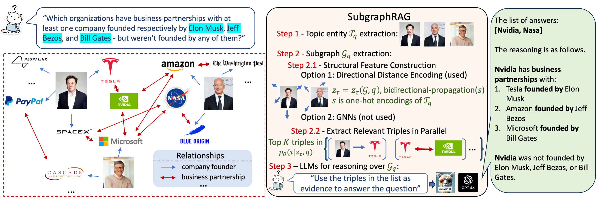

# SubgraphRAG, Simple Yet Effective KG-Based RAG

[[Paper]](https://arxiv.org/abs/2410.20724)



## Table of Contents

- [Usage](#usage)
- [Citation](#citation)

## Usage

SubgraphRAG is a retrieval-and-reasoning pipeline for knowledge-graph-based retrieval-augmented generation. 

1. For the retrieval stage, see [the retrieve folder](./retrieve/).
2. For the reasoning stage, see [the reason folder](./reason/).

## Citation

```tex
@article{li2024subgraphrag,
    title={Simple is Effective: The Roles of Graphs and Large Language Models in Knowledge-Graph-Based Retrieval-Augmented Generation},
    author={Li, Mufei and Miao, Siqi and Li, Pan},
    journal={arXiv preprint arXiv:2410.20724},
    year={2024}
}
```
